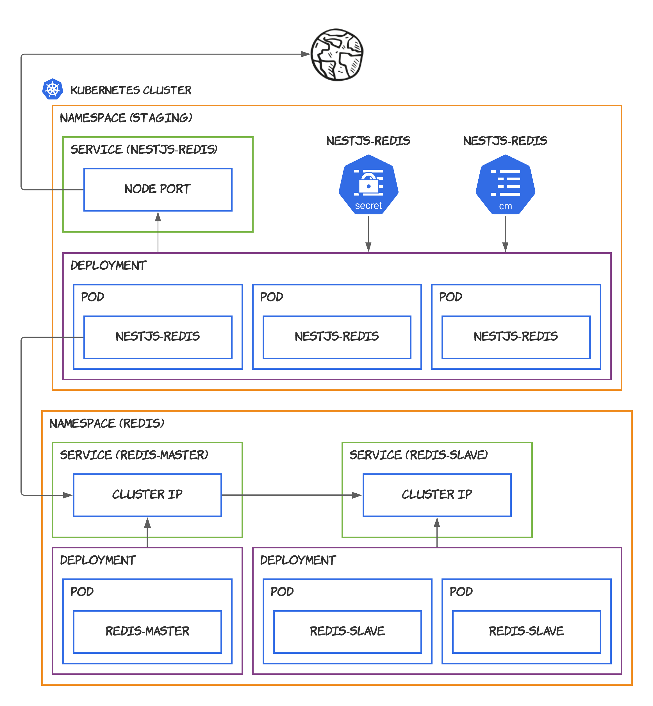

# FIAP: Kubernetes!

Esse repositório contém os scripts para provisionar o Redis (em _cluster mode_) e a aplicação [nestjs-redis](https://github.com/wnqueiroz/nestjs-redis) no Kubernetes utilizando o [minikube](https://minikube.sigs.k8s.io/docs/).

<p align="center">
  
</p>

## Pré-requisitos

Antes de executar os scripts, é necessário instalar as ferramentas que são utilizadas nessa demo:

Ferramentas:

- Docker
- kubectl
- minikube

As instalações a seguir devem ser realizadas em uma distribuição linux (de preferência, ubuntu :P).

### Instalando o Docker

Execute o comando que instalará o Docker:

```bash
curl -fsSL https://get.docker.com | sudo sh
```

Por fim, adicione o seu usuário para conseguir executar os comandos `docker`:

```bash
sudo usermod -aG docker $USER
```

> Encerre a sessão atual, e entre novamente para não ter problemas ao executar os comandos

Valide a instalação com:

```bash
docker --version
```

> Veja mais em: https://docs.docker.com/engine/install/ubuntu/#install-using-the-convenience-script

### Instalando o kubectl

Execute os comandos que instalarão o kubectl:

```bash
curl -LO "https://storage.googleapis.com/kubernetes-release/release/$(curl -s https://storage.googleapis.com/kubernetes-release/release/stable.txt)/bin/linux/amd64/kubectl"

chmod +x ./kubectl

sudo mv ./kubectl /usr/local/bin/kubectl
```

Valide a instalação com:

```bash
kubectl version --client
```

> Veja mais em: https://kubernetes.io/docs/tasks/tools/install-kubectl/

### Instalando o minikube

Execute os comandos que instalarão o minikube:

```bash
curl -LO https://storage.googleapis.com/minikube/releases/latest/minikube-linux-amd64

sudo install minikube-linux-amd64 /usr/local/bin/minikube
```

Inicie o cluster com:

```bash
minikube start
```

> Veja mais em: https://minikube.sigs.k8s.io/docs/start/

## Hands-On!

Os comandos para gerenciar e provisionar os pods e serviços no nosso cluster estão nos arquivos abaixo, na raiz do repositório:

- [00-install-redis.sh](./00-install-redis.sh)
- [01-install-nestjs-redis.sh](./01-install-nestjs-redis.sh)
